# Heroku Review Appsの設定

- herokuの作成したapplicationからDeployタブを選択し、GitHub連携を行う
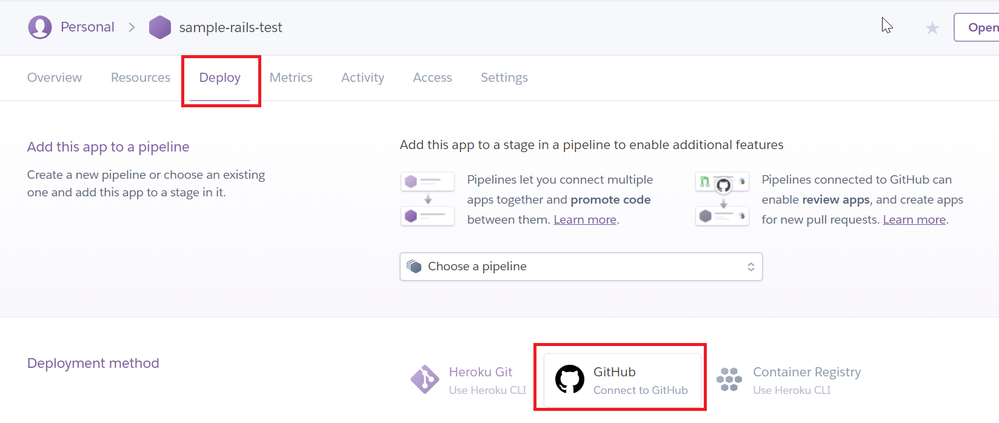
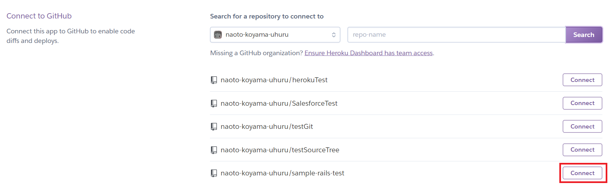

- Add this app to a pipelineから「Choose a pipline」を選択し、「Create new pipline」をクリックする
  - Name the piplineを入力して、「Create pipline」ボタンを押下
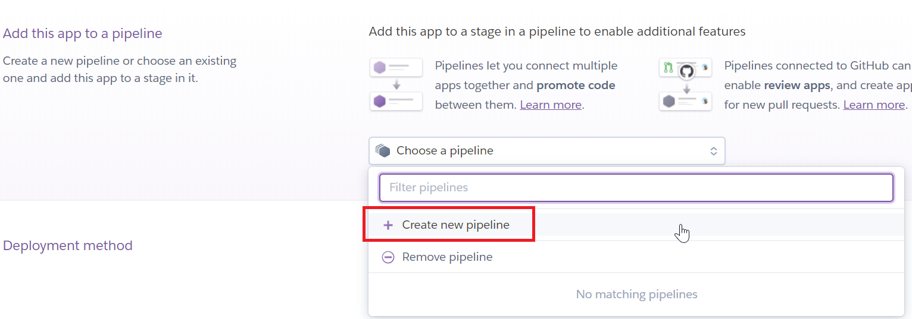
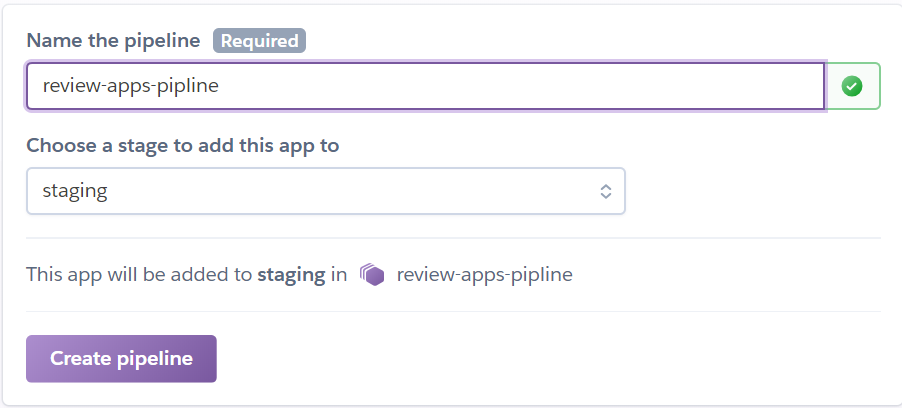

- Piplineの設定画面で、「Enable Review apps」を選択
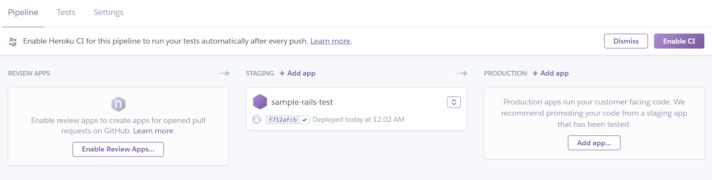
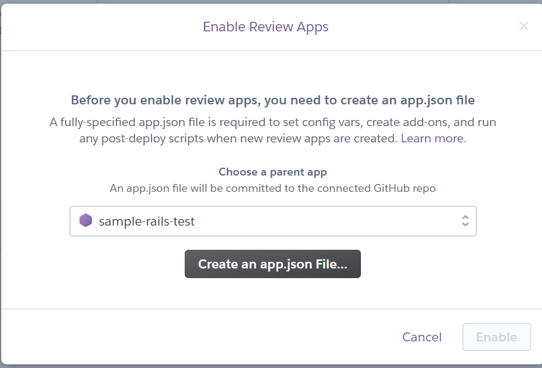

- Scriptに```bundle exec rails db:migrate```と入力
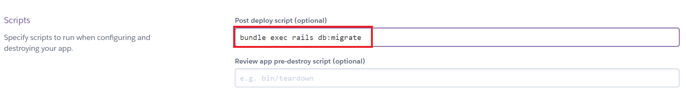

- 確認画面で「Create new review apps for new pull requests automatically」と「Destroy stale review apps」にチェックを入れ、いつ環境を消すのかを選択
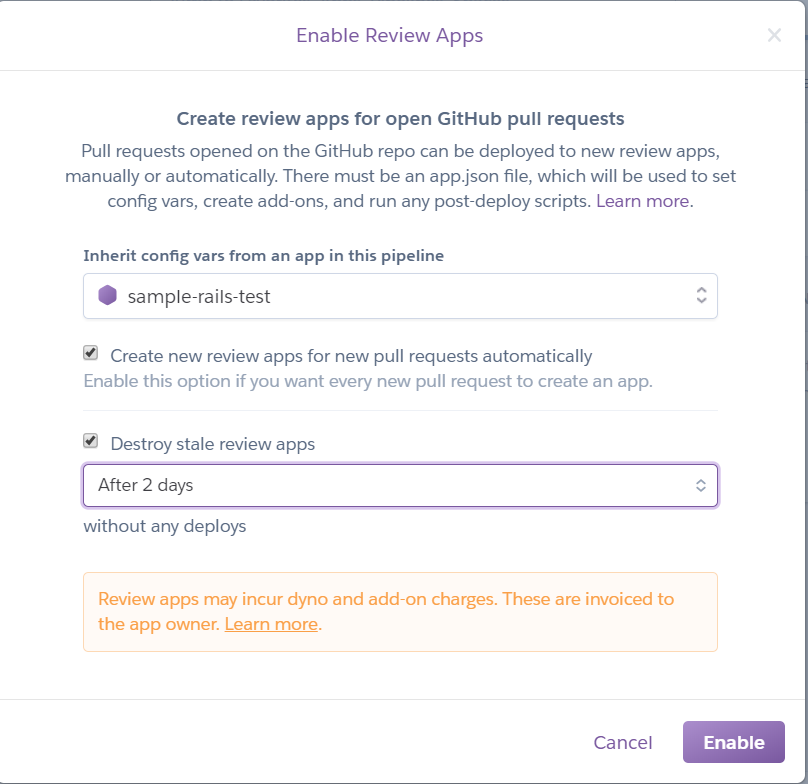

- MRごとに環境が立ち上がるのをHeroku上で確認する
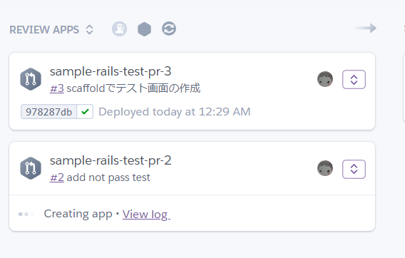

- 環境に接続することも可能
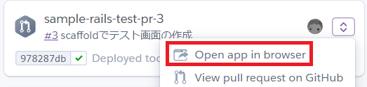

- CIの結果も確認できる
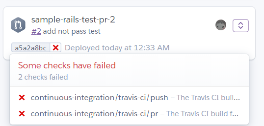
