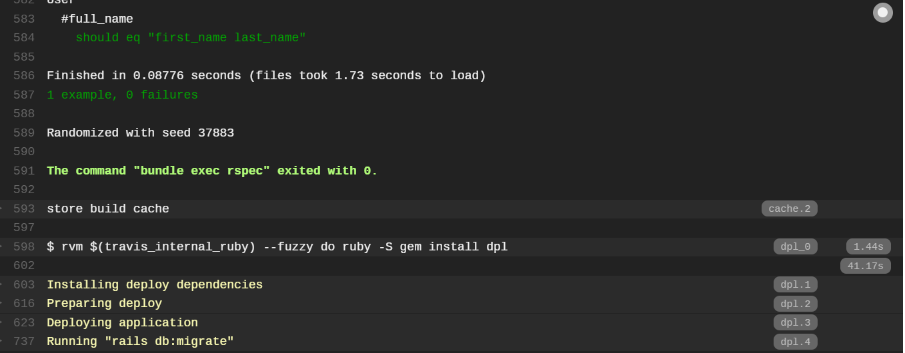

# Herokuの設定

- [Heroku](https://www.heroku.com/)に登録する
- Heroku CLIのインストール
```bash
$ wget -qO- https://cli-assets.heroku.com/install-ubuntu.sh | sh
$ heroku --version
heroku/7.19.3 linux-x64 node-v11.3.0
```
- Herokuへログイン
  - Webブラウザ上で入力を求められるので、登録したアドレスとパスワードを入力
```bash
$ heroku login
```

- アプリケーションの作成
```bash
$ heroku login
$ heroku create [アプリケーション名]
```

- herokuの連携設定をするためにtravisのgemをインストール
```bash
$ gem install travis
$ travis setup heroku -r naoto-koyama-uhuru/sample-rails-test # githubのユーザ名/githubのリポジトリ
Deploy only from naoto-koyama-uhuru/sample-rails-test? |yes| yes
Encrypt API key? |yes| yes
```

- .travis.ymlを見てdeploy以下の設定が反映されていることを確認
- migrationの設定を追加

```.travis.yml```
```yml
language: ruby
rvm: 2.4.3
addons:
  postgresql: '9.6'
bundler_args: "--without development --deployment -j4"
cache: bundler
before_script:
- cp config/database.travis.yml config/database.yml
- bundle exec rails db:setup
script: bundle exec rspec
deploy:
  provider: heroku
  api_key:
    secure: [key]
  app: sample-rails-test
  on:
    repo: naoto-koyama-uhuru/sample-rails-test
  run: "rails db:migrate" # deploy後にmigrationの設定
```

- テスト実行後にHerokuへdeployされていることを確認する


