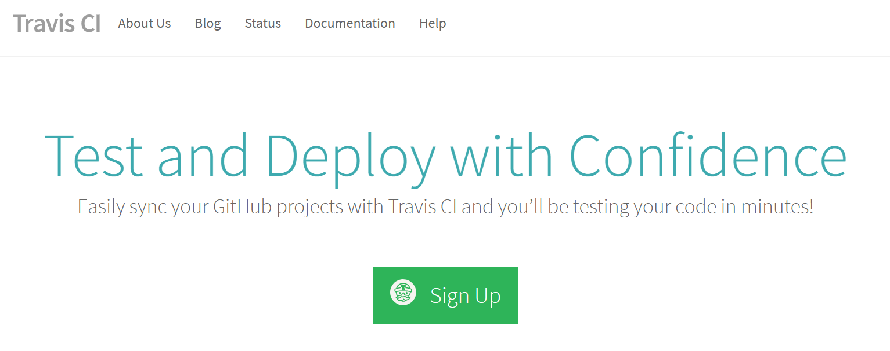
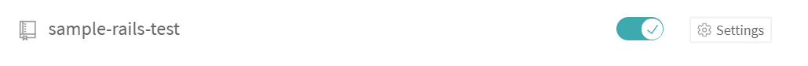
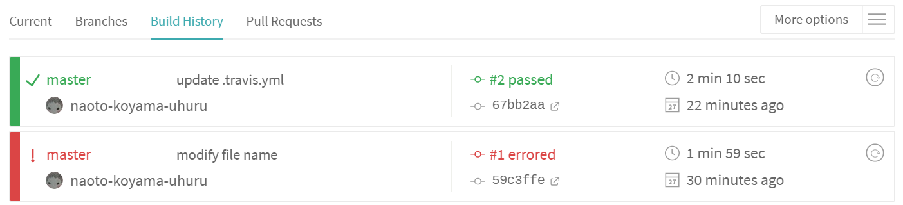
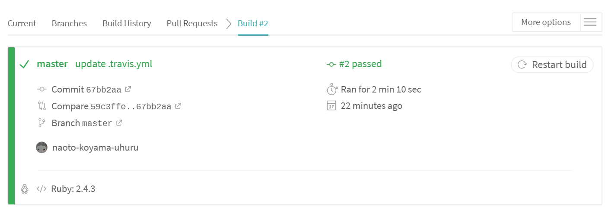
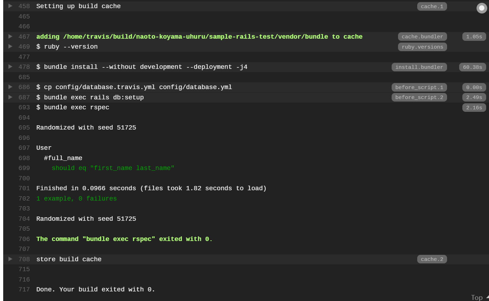
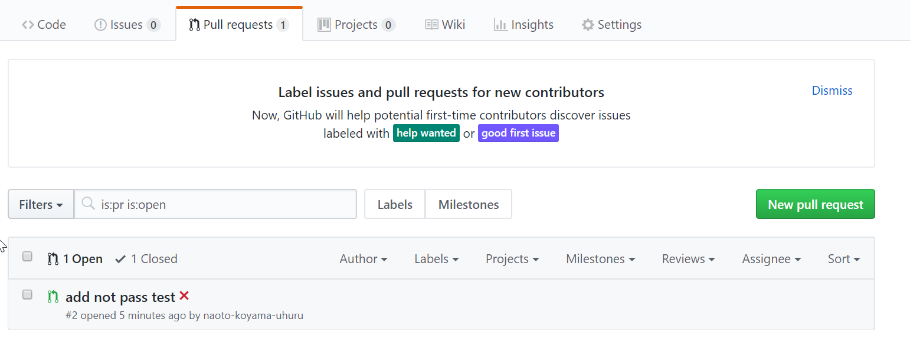
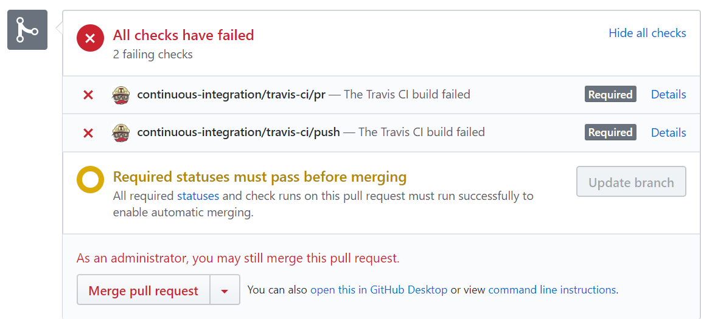
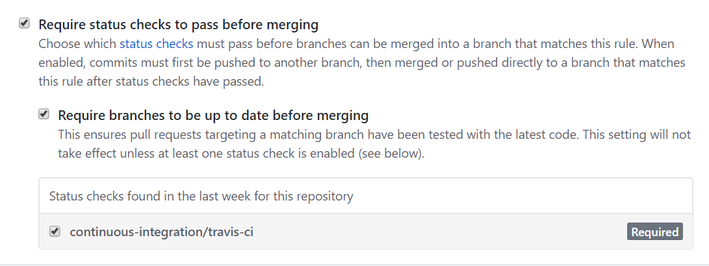
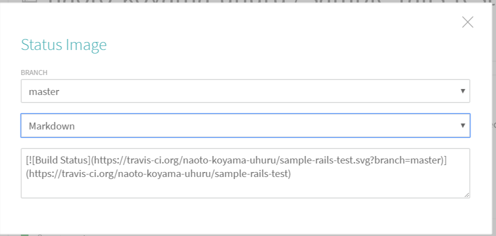

# Travis CIの設定

## Sign Up

- https://travis-ci.org/ に接続

- githubと連携することができるため、パスワードを入力して連携


## 連携の設定
- CIを設定したいリポジトリのトグルがオフになっているため、オンに設定


- configファイルを作成する
  - postgresはデフォルト9.2のため、9.6で作成

```.travis.yml```
```yml
language: ruby
rvm: 2.4.3
addons:
  postgresql: "9.6"
bundler_args: "--without development --deployment -j4"
cache: bundler
before_script:
  - cp config/database.travis.yml config/database.yml
  - bundle exec rails db:setup
script: bundle exec rspec

```

```config/database.travis.yml```
```yml
test:
  adapter: postgresql
  database: test
  username: postgres
```

- GitHubへpushすると、Build Historyから確認できる




- GitHub上でも確認可能




## CIが通っていないとマージされないようにGitHub側の設定
- リポジトリのSettingsを選択

- OptionsのBranchesを選択

- Apply rule toに「master」を入力
- Rule settingsで
  - 「Require status checks to pass before merging」をチェック
  - 「Require branches to be up to date before merging」をチェック
  - 「continuous-integration/travis-ci」をチェック


## バッジの設定
- travic ciでバッジを選択

- Status Imageが表示されるため、「Markdown」を選択して、READMEの先頭に表示されているタグをコピーしてpushしておく



